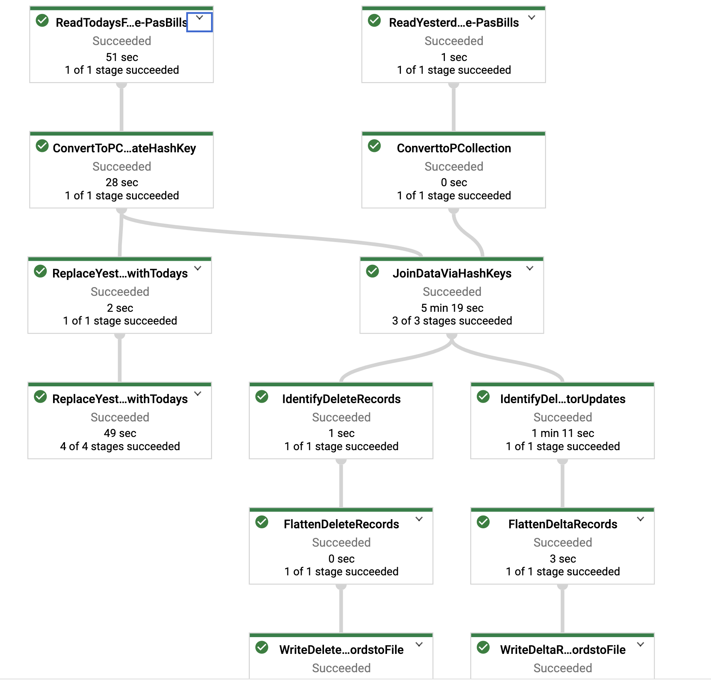

# About Google cloud Dataflow POC 

This is a sample cloud dataflow POC which performs the following

 - Read Todays and yesterdays data dump for a table
 - Compare the data from Todays to Yesterdays file  
	 -  In the example the Yesterdays file contain the hash key
	 - From todays file keys are read and hashed
	 - Hashed key from todays file compared to hashed key from yesterday
	 - Inserts and updates identified - written to an update file
 - Compare the data from yesterdays file to todays file
	 - Check if the hash key in yestedays file exists in todays file (Hash key created dynamically)
	 - If hashkey does not exist write the record to a delete file

The flow diagram is given below

# Technologies used

 - Apache Beam
	    The pipelining technology used is apache beam. Beam is a unifier and can run on multiple platforms like Google cloud dataflow , apache spark , hadoop etc. The power of beam is to abstract user from undelying execution api knowledge , Rdd creation etc. All these are taken care by the beam framework therefore providing designers and developers with a powerful pipelining framework. There are out of the box adapters for sources like kafka , jdbc data store , big query , pubsub etc.
 - Cloud Dataflow
	   This is the ***"Runner"*** technology or platform where the pipeline code runs. 
 - CloudFuntion
	 - Cloud function is used to trigger the google cloud dataflow job.

 
# Setup Steps

 - [ ] Setup and authenticate Google cloud account
	 
 - [ ] Setup bucket for the application
 - [ ] Create service account and download the json key
	 - Enable the cloud dataflow api
	 - Enable the cloudfunction api (Optional)
 - [ ] Set the cloud app credentials variable
		 

		    export GOOGLE_APPLICATION_CREDENTIALS="/Users/anbose/Downloads/*****-cloudstorage.json"

 - [ ] Compile the code and export the dataflow template to cloud
				

> mvn compile exec:java -Dexec.mainClass=com.clgx.tax.beam.pipelines.samples.PasBillsSampleCompare -Dexec.args="--runner=DataflowRunner  
--project=spheric-mesh-294917  
--stagingLocation=gs://gcdf_demo_test/staging  
--templateLocation=gs://gcdf_demo_test/templates/PasBillsSampleCompare-new  
--region=us-central1-a  
--gcpTempLocation=gs://gcdf_demo_test/temp" -Pdataflow-runner
 - [ ] For Bigquery sample execute the following

> mvn compile exec:java -Dexec.mainClass=com.clgx.tax.beam.pipelines.samples.PasBillsSampleCompareBigQuery -Dexec.args="--runner=DataflowRunner  
--project=spheric-mesh-294917  
--stagingLocation=gs://gcdf_demo_test/staging  
--templateLocation=gs://gcdf_demo_test/templates/PasBillsSampleCompareBigQuery  
--region=us-central1-a  
--gcpTempLocation=gs://gcdf_demo_test/temp --tempLocation=gs://gcdf_demo_test/temp" -Pdataflow-runner

 - [ ] For PasAmount Joins execute the following steps
> mvn compile exec:java -Dexec.mainClass=com.clgx.tax.beam.pipelines.samples.PasDataJoinMultipleDataSets -Dexec.args="--runner=DataflowRunner  \
--project=spheric-mesh-294917  \
--stagingLocation=gs://gcdf_demo_test/staging  \
--templateLocation=gs://gcdf_demo_test/templates/PasJoinMultipleTables \
--region=us-central1-a  \
--gcpTempLocation=gs://gcdf_demo_test/temp --tempLocation=gs://gcdf_demo_test/temp" -Pdataflow-runner

- [ ] For Testing elastic search execute the following steps

> mvn compile exec:java -Dexec.mainClass=com.clgx.tax.beam.pipelines.samples.PasDataToElastic -Dexec.args="--runner=DataflowRunner  \
--project=spheric-mesh-294917  \
--stagingLocation=gs://gcdf_demo_test/staging  \
--templateLocation=gs://gcdf_demo_test/templates/PasToElastic \
--region=us-central1-a  \
--gcpTempLocation=gs://gcdf_demo_test/temp --tempLocation=gs://gcdf_demo_test/temp" -Pdataflow-runner

- [] Elastic testing

>curl -XGET 'http://localhost:9200/pasdata/_search?pretty=true' -H 'Content-Type: application/json' -d '{ "query": {  "match_all": {}  } }'

# Execution Steps

 - Export file into the input folder (Please note that the file name must have a substring - PAS_PRCL_BILLS_copy)
 - The cloudfunction should trigger this automatically
 - Manually triggering the job - command line
	 - From the cloudshell execute

> gcloud dataflow jobs run pasbills-first-run --gcs-location gs://gcdf_demo_test/templates/PasBillsSampleCompare --region us-central1 --num-workers 5 --staging-location gs://gcdf_demo_test/temp --parameters yesterdaysFile1=gs://gcdf_demo_test/files/input/yesterday_file_generate.csv,delOutput=gs://gcdf_demo_test/files/output/delete-deltas.csv,todaysFile1=gs://gcdf_demo_test/files/input/PAS_PRCL_BILLS_copy.csv,output=gs://gcdf_demo_test/files/output/update-deltas.csv

 
